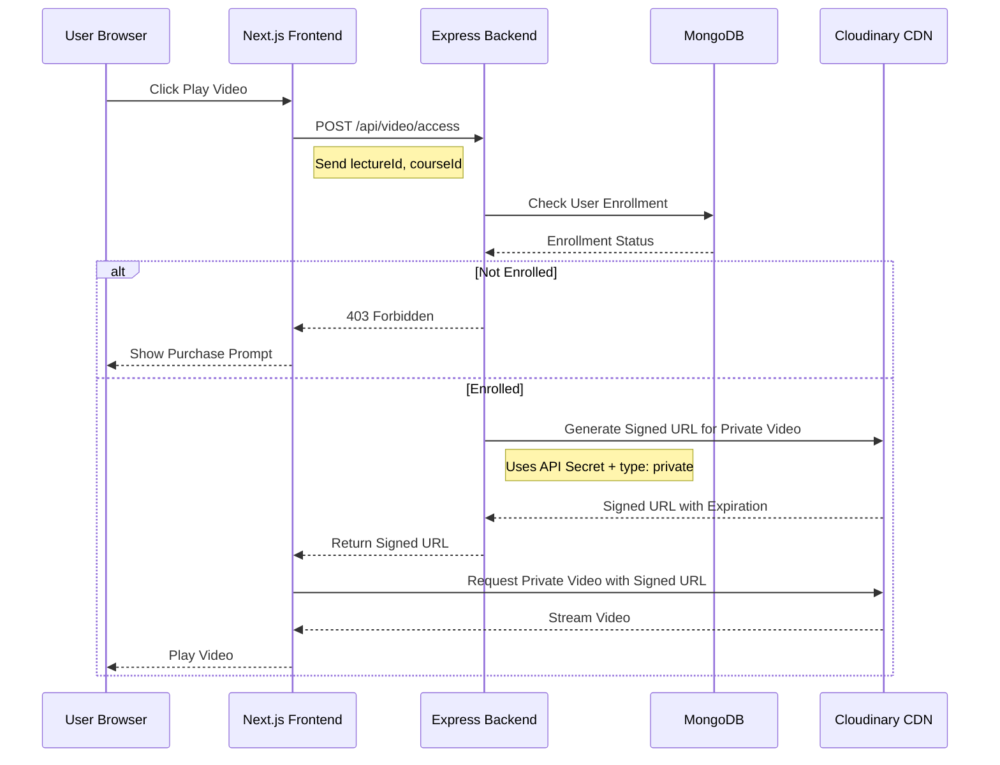

# Secure Video URL Implementation Plan

## Problem Statement

Currently, video URLs from Cloudinary are exposed directly in the frontend code. Users can:

1. Open browser DevTools → Network tab
2. Find the video URL
3. Share it with unauthorized users

This allows unauthenticated users to access paid course content.

## Cloudinary's Built-in Security Approaches

Cloudinary provides **three main approaches** to secure media assets:

### 1. Signed URLs (Recommended for Your Use Case)

Signed URLs are time-limited URLs that expire after a specified duration. The URL contains a cryptographic signature that Cloudinary validates before serving the content.

**How it works:**

```
Regular URL:     https://res.cloudinary.com/cloud-name/video/upload/v1234567890/videos/myvideo.mp4
Signed URL:      https://res.cloudinary.com/cloud-name/video/upload/v1234567890/videos/myvideo.mp4?_a=ABC123DEF456
```

The signature `_a` parameter is generated using:

- Your API secret (kept on server)
- The public_id of the video
- Expiration timestamp

**Benefits:**

- URL expires after set time (e.g., 1 hour)
- Cannot be forged without API secret
- No additional Cloudinary configuration needed
- Works with existing video player

**Limitations:**

- URL is still visible in network tab, but only works for limited time
- User could download video during valid window

### 2. Private Delivery Type

Videos are marked as `private` and can only be accessed via signed URLs.

**Upload with private type:**

```typescript
const options = {
  resource_type: "video",
  type: "private", // Makes video inaccessible via regular URL
};
```

**Access requires signed URL:**

```typescript
const signedUrl = cloudinary.url("videos/myvideo", {
  resource_type: "video",
  type: "private",
  sign_url: true,
  expires_at: Math.floor(Date.now() / 1000) + 3600, // 1 hour
});
```

**Benefits:**

- Videos cannot be accessed at all without signed URL
- Higher security level

**Limitations:**

- Requires re-uploading existing videos with `type: 'private'`
- More complex migration

### 3. Authenticated Delivery Type

Most restrictive - requires authentication token for every request.

**Benefits:**

- Highest security level
- Token-based access control

**Limitations:**

- More complex implementation
- Requires Cloudinary's authentication token generation
- May require Cloudinary paid plan features

---

## Recommended Solution: Private Delivery Type with Signed URLs

For your LMS with higher security requirements, I recommend **Private Delivery Type** combined with signed URLs. This provides stronger protection by making videos completely inaccessible without a valid signed URL.

### Architecture Overview



### Private Delivery Type: How It Works

With Private Delivery Type, videos are stored with `type: 'private'` in Cloudinary:

```
Regular URL:    https://res.cloudinary.com/cloud-name/video/upload/v123/videos/myvideo.mp4
                 ↑ Accessible to anyone with the URL

Private URL:    https://res.cloudinary.com/cloud-name/video/private/v123/videos/myvideo.mp4
                 ↑ Returns 404 without signed URL

Signed Private: https://res.cloudinary.com/cloud-name/video/private/v123/videos/myvideo.mp4?_a=ABC123
                 ↑ Only works with valid signature + expiration
```

**Key Difference:**

- Regular videos: URL is always accessible
- Private videos: URL returns 404 Forbidden without valid signature

### Implementation Components

#### 1. Server-Side: Update Video Uploader for Private Type

Modify [`server/utils/cloudinary.ts`](server/utils/cloudinary.ts):

```typescript
// Update video uploader to use private delivery type
export async function videoUploader(video: string | Buffer) {
  const options = {
    resource_type: "video" as const,
    type: "private" as const, // ← Makes video inaccessible without signed URL
    timeout: 12000000,
  };
  try {
    let result: UploadApiResponse | undefined;
    if (typeof video === "string") {
      result = await cloudinary.uploader.upload(video, options);
    } else if (video instanceof Buffer) {
      result = await new Promise<UploadApiResponse>((resolve, reject) => {
        cloudinary.uploader
          .upload_stream(options, (error, uploadResult) => {
            if (error) return reject(error);
            return resolve(uploadResult!);
          })
          .end(video);
      });
    }
    return result;
  } catch (error) {
    console.log("error uploading video from cloudinary");
    console.error(error);
    return undefined;
  }
}

/**
 * Generates a time-limited signed URL for PRIVATE video access
 * @param publicId - The Cloudinary public_id of the video
 * @param expiresIn - Expiration time in seconds (default: 1 hour)
 * @returns Signed URL that expires after specified time
 */
export const generateSignedVideoUrl = (
  publicId: string,
  expiresIn: number = 3600,
): string => {
  const timestamp = Math.floor(Date.now() / 1000) + expiresIn;

  const signedUrl = cloudinary.url(publicId, {
    resource_type: "video",
    type: "private", // ← Must match upload type
    sign_url: true,
    secure: true,
    expires_at: timestamp,
  });

  return signedUrl;
};
```

#### 2. Server-Side: Video Access Endpoint

Create new endpoint in your Express server:

```typescript
// POST /api/video/access
// Request: { lectureId: string, courseId: string }
// Response: { signedUrl: string, expiresAt: number }

router.post("/video/access", authenticateUser, async (req, res) => {
  const { lectureId, courseId } = req.body;
  const userId = req.user.id;

  // 1. Check if user is enrolled in the course
  const enrollment = await prisma.enrolledCourse.findFirst({
    where: {
      userId: userId,
      courseId: courseId,
    },
  });

  if (!enrollment) {
    return res.status(403).json({
      error: "You must enroll in this course to access videos",
    });
  }

  // 2. Get video public_id from lecture
  const lecture = await prisma.lecture.findUnique({
    where: { id: lectureId },
    select: { videoPublicId: true },
  });

  if (!lecture || !lecture.videoPublicId) {
    return res.status(404).json({ error: "Video not found" });
  }

  // 3. Generate signed URL (expires in 1 hour)
  const expiresIn = 3600; // 1 hour
  const signedUrl = generateSignedVideoUrl(lecture.videoPublicId, expiresIn);

  res.json({
    signedUrl,
    expiresAt: Date.now() + expiresIn * 1000,
  });
});
```

#### 3. Frontend: Video Access Hook

Create a custom hook for fetching signed URLs:

```typescript
// client/src/hooks/useVideoAccess.ts

export function useVideoAccess() {
  const [isLoading, setIsLoading] = useState(false);
  const [error, setError] = useState<string | null>(null);

  const getSignedUrl = async (lectureId: string, courseId: string) => {
    setIsLoading(true);
    setError(null);

    try {
      const response = await axios.post("/api/video/access", {
        lectureId,
        courseId,
      });

      return response.data; // { signedUrl, expiresAt }
    } catch (err) {
      if (err.response?.status === 403) {
        setError("You must purchase this course to watch videos");
      } else {
        setError("Failed to load video");
      }
      return null;
    } finally {
      setIsLoading(false);
    }
  };

  return { getSignedUrl, isLoading, error };
}
```

#### 4. Frontend: Update Video Player Component

Modify [`client/src/components/vedioPlayer.tsx`](client/src/components/vedioPlayer.tsx):

```typescript
// Instead of passing URL directly, fetch signed URL when playing
const VideoPlayerComponent = ({ lectureId, courseId }) => {
  const [videoUrl, setVideoUrl] = useState<string | null>(null)
  const { getSignedUrl, isLoading, error } = useVideoAccess()

  useEffect(() => {
    // Fetch signed URL when component mounts
    getSignedUrl(lectureId, courseId).then(data => {
      if (data) {
        setVideoUrl(data.signedUrl)

        // Set up refresh before expiration
        const refreshTime = data.expiresAt - Date.now() - 60000 // 1 min before
        setTimeout(() => {
          getSignedUrl(lectureId, courseId).then(refreshData => {
            if (refreshData) setVideoUrl(refreshData.signedUrl)
          })
        }, refreshTime)
      }
    })
  }, [lectureId, courseId])

  if (isLoading) return <VideoSkeleton />
  if (error) return <Error message={error} />

  return (
    <VideoPlayer>
      <VideoPlayerContent src={videoUrl} />
    </VideoPlayer>
  )
}
```

---

## Database Schema Changes

Your current schema stores `videoPublicId` and `videoUrl` in the Lecture model. You should:

1. **Keep `videoPublicId`** - This is needed to generate signed URLs
2. **Remove `videoUrl` from frontend responses** - Never send the direct URL to frontend

Update your lecture queries to exclude `videoUrl`:

```typescript
const lecture = await prisma.lecture.findUnique({
  where: { id: lectureId },
  select: {
    id: true,
    title: true,
    description: true,
    duration: true,
    videoPublicId: true, // Keep for server-side use
    // videoUrl: true, // REMOVE from frontend responses
  },
});
```

---

## Security Considerations

### What Private Delivery Type Protects Against:

- ✅ Sharing URLs that work indefinitely (URLs expire)
- ✅ Direct access without enrollment (returns 404)
- ✅ Hotlinking from external sites (URLs expire + 404 without signature)
- ✅ Guessing the video URL (private URLs return 404 without valid signature)

### What This Does NOT Protect Against:

- ❌ Screen recording by enrolled users
- ❌ Video download during valid URL window
- ❌ Account sharing

---

## Migration Strategy for Existing Videos

Since you have existing videos uploaded without the `private` type, you need to migrate them:

### Option A: Re-upload Videos (Recommended for small number of videos)

1. Download existing videos from Cloudinary
2. Re-upload with `type: 'private'`
3. Update database with new `public_id`

### Option B: Use Cloudinary's Rename API (No re-upload needed)

Cloudinary allows changing the delivery type without re-uploading:

```typescript
// Migration script to change existing videos to private
export async function migrateVideoToPrivate(publicId: string) {
  try {
    const result = await cloudinary.uploader.rename(publicId, publicId, {
      resource_type: "video",
      type: "upload", // Current type
      to_type: "private", // New type
    });
    console.log(`Migrated ${publicId} to private type`);
    return result;
  } catch (error) {
    console.error(`Failed to migrate ${publicId}:`, error);
    throw error;
  }
}

// Script to migrate all videos
async function migrateAllVideos() {
  const lectures = await prisma.lecture.findMany({
    where: { videoPublicId: { not: null } },
    select: { id: true, videoPublicId: true },
  });

  for (const lecture of lectures) {
    if (lecture.videoPublicId) {
      await migrateVideoToPrivate(lecture.videoPublicId);
      console.log(`Migrated lecture ${lecture.id}`);
    }
  }
}
```

### Option C: Keep Existing Videos, Apply to New Videos Only

If migration is too complex:

1. Keep existing videos as-is (they'll still use signed URLs)
2. Apply `type: 'private'` only to newly uploaded videos
3. This provides partial protection while avoiding migration

---

## Implementation Checklist

### Phase 1: Backend Changes

- [ ] Update `videoUploader` function to use `type: 'private'`
- [ ] Add `generateSignedVideoUrl` function with `type: 'private'`
- [ ] Create `/api/video/access` endpoint with enrollment verification
- [ ] Update lecture queries to exclude `videoUrl` from responses
- [ ] Add authentication middleware to video endpoint

### Phase 2: Migrate Existing Videos

- [ ] Create migration script to change existing videos to private type
- [ ] Run migration on all existing lectures with videos
- [ ] Verify migrated videos work with signed URLs

### Phase 3: Frontend Changes

- [ ] Create `useVideoAccess` hook for fetching signed URLs
- [ ] Update [`client/src/components/vedioPlayer.tsx`](client/src/components/vedioPlayer.tsx) to use signed URLs
- [ ] Update [`client/src/app/(home)/courses/_components/modules.tsx`](<client/src/app/(home)/courses/_components/modules.tsx>) to pass lectureId instead of videoUrl
- [ ] Add loading states and error handling for unauthorized access

### Phase 3: Testing

- [ ] Test signed URL generation and expiration
- [ ] Test enrollment verification
- [ ] Test video playback for enrolled users
- [ ] Test access denial for non-enrolled users
- [ ] Test URL refresh before expiration

---

## Migration Path

For existing videos:

1. **No re-upload needed** - Signed URLs work with existing videos
2. **Update API responses** - Stop returning `videoUrl` in lecture data
3. **Update frontend** - Switch to signed URL fetching

For new videos:

1. Continue uploading as normal
2. Store only `public_id` in database
3. Generate signed URLs on demand

---

## Summary

The recommended approach uses **Cloudinary Signed URLs** with:

1. **Server-side generation** - API secret never exposed to frontend
2. **Time-limited access** - URLs expire after 1 hour
3. **Enrollment verification** - Only enrolled users get valid URLs
4. **Automatic refresh** - Frontend refreshes URL before expiration

This provides Medium security suitable for a paid LMS platform while maintaining good user experience.
